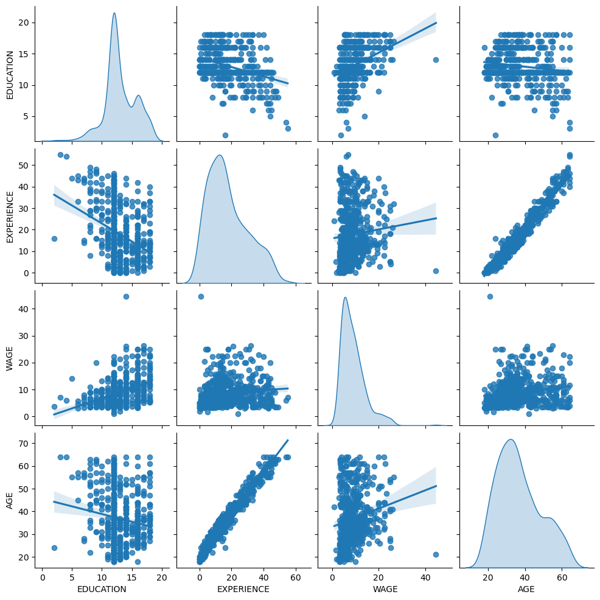
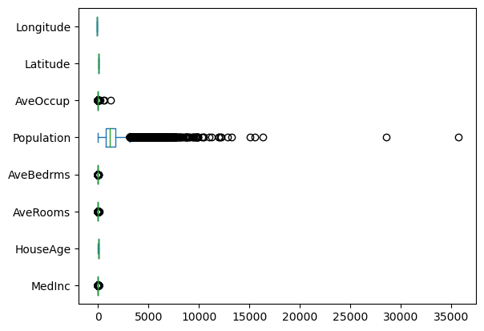
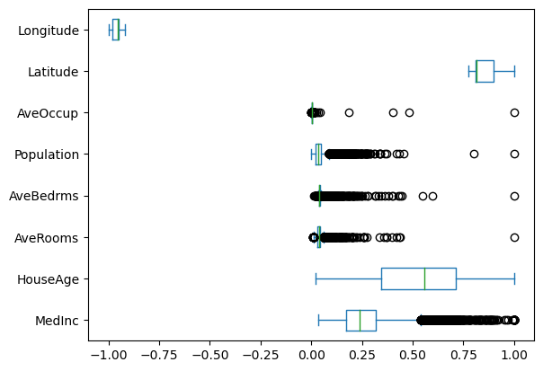
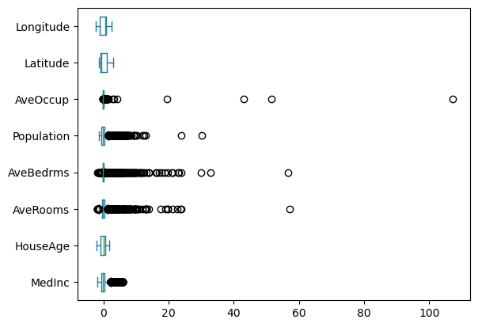
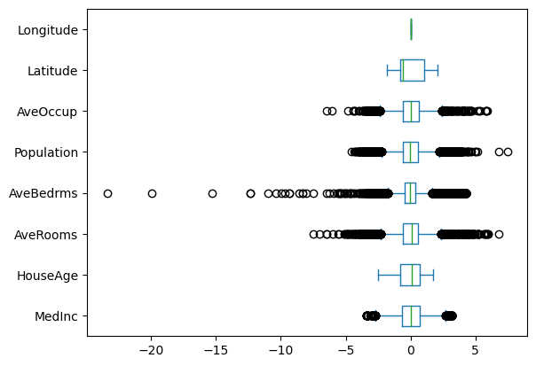
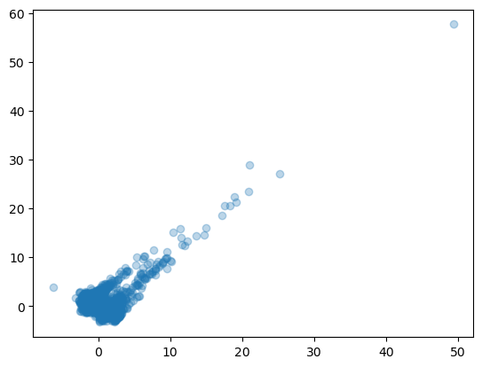

# Data Science Society Python Workshop 2023
> ***Just enoungh to be dangerous***

## Data import and preprocessing

 1. Standardization and OneHotEncoding
 2. Dimension reduction


```python
import numpy as np
import pandas as pd
import sklearn as sk
import matplotlib.pyplot as plt
import seaborn as sns
```


```python
from sklearn import datasets
wage=datasets.fetch_openml(data_id=534,as_frame=True, parser="pandas")
housing=datasets.fetch_california_housing(as_frame=True)
```


```python
feature_wage = wage.feature_names
feature_housing = housing.feature_names #
```


```python
house_data=housing['frame']
wage_data=wage['frame']
house_data
```


<div>
<style scoped>
    .dataframe tbody tr th:only-of-type {
        vertical-align: middle;
    }

    .dataframe tbody tr th {
        vertical-align: top;
    }

    .dataframe thead th {
        text-align: right;
    }
</style>
<table border="1" class="dataframe">
  <thead>
    <tr style="text-align: right;">
      <th></th>
      <th>MedInc</th>
      <th>HouseAge</th>
      <th>AveRooms</th>
      <th>AveBedrms</th>
      <th>Population</th>
      <th>AveOccup</th>
      <th>Latitude</th>
      <th>Longitude</th>
      <th>MedHouseVal</th>
    </tr>
  </thead>
  <tbody>
    <tr>
      <th>0</th>
      <td>8.3252</td>
      <td>41.0</td>
      <td>6.984127</td>
      <td>1.023810</td>
      <td>322.0</td>
      <td>2.555556</td>
      <td>37.88</td>
      <td>-122.23</td>
      <td>4.526</td>
    </tr>
    <tr>
      <th>1</th>
      <td>8.3014</td>
      <td>21.0</td>
      <td>6.238137</td>
      <td>0.971880</td>
      <td>2401.0</td>
      <td>2.109842</td>
      <td>37.86</td>
      <td>-122.22</td>
      <td>3.585</td>
    </tr>
    <tr>
      <th>2</th>
      <td>7.2574</td>
      <td>52.0</td>
      <td>8.288136</td>
      <td>1.073446</td>
      <td>496.0</td>
      <td>2.802260</td>
      <td>37.85</td>
      <td>-122.24</td>
      <td>3.521</td>
    </tr>
    <tr>
      <th>3</th>
      <td>5.6431</td>
      <td>52.0</td>
      <td>5.817352</td>
      <td>1.073059</td>
      <td>558.0</td>
      <td>2.547945</td>
      <td>37.85</td>
      <td>-122.25</td>
      <td>3.413</td>
    </tr>
    <tr>
      <th>4</th>
      <td>3.8462</td>
      <td>52.0</td>
      <td>6.281853</td>
      <td>1.081081</td>
      <td>565.0</td>
      <td>2.181467</td>
      <td>37.85</td>
      <td>-122.25</td>
      <td>3.422</td>
    </tr>
    <tr>
      <th>...</th>
      <td>...</td>
      <td>...</td>
      <td>...</td>
      <td>...</td>
      <td>...</td>
      <td>...</td>
      <td>...</td>
      <td>...</td>
      <td>...</td>
    </tr>
    <tr>
      <th>20635</th>
      <td>1.5603</td>
      <td>25.0</td>
      <td>5.045455</td>
      <td>1.133333</td>
      <td>845.0</td>
      <td>2.560606</td>
      <td>39.48</td>
      <td>-121.09</td>
      <td>0.781</td>
    </tr>
    <tr>
      <th>20636</th>
      <td>2.5568</td>
      <td>18.0</td>
      <td>6.114035</td>
      <td>1.315789</td>
      <td>356.0</td>
      <td>3.122807</td>
      <td>39.49</td>
      <td>-121.21</td>
      <td>0.771</td>
    </tr>
    <tr>
      <th>20637</th>
      <td>1.7000</td>
      <td>17.0</td>
      <td>5.205543</td>
      <td>1.120092</td>
      <td>1007.0</td>
      <td>2.325635</td>
      <td>39.43</td>
      <td>-121.22</td>
      <td>0.923</td>
    </tr>
    <tr>
      <th>20638</th>
      <td>1.8672</td>
      <td>18.0</td>
      <td>5.329513</td>
      <td>1.171920</td>
      <td>741.0</td>
      <td>2.123209</td>
      <td>39.43</td>
      <td>-121.32</td>
      <td>0.847</td>
    </tr>
    <tr>
      <th>20639</th>
      <td>2.3886</td>
      <td>16.0</td>
      <td>5.254717</td>
      <td>1.162264</td>
      <td>1387.0</td>
      <td>2.616981</td>
      <td>39.37</td>
      <td>-121.24</td>
      <td>0.894</td>
    </tr>
  </tbody>
</table>
<p>20640 rows × 9 columns</p>
</div>


```python
wage_data.describe(include="all")
```


<div>
<style scoped>
    .dataframe tbody tr th:only-of-type {
        vertical-align: middle;
    }

    .dataframe tbody tr th {
        vertical-align: top;
    }

    .dataframe thead th {
        text-align: right;
    }
</style>
<table border="1" class="dataframe">
  <thead>
    <tr style="text-align: right;">
      <th></th>
      <th>EDUCATION</th>
      <th>SOUTH</th>
      <th>SEX</th>
      <th>EXPERIENCE</th>
      <th>UNION</th>
      <th>WAGE</th>
      <th>AGE</th>
      <th>RACE</th>
      <th>OCCUPATION</th>
      <th>SECTOR</th>
      <th>MARR</th>
    </tr>
  </thead>
  <tbody>
    <tr>
      <th>count</th>
      <td>534.000000</td>
      <td>534</td>
      <td>534</td>
      <td>534.000000</td>
      <td>534</td>
      <td>534.000000</td>
      <td>534.000000</td>
      <td>534</td>
      <td>534</td>
      <td>534</td>
      <td>534</td>
    </tr>
    <tr>
      <th>unique</th>
      <td>NaN</td>
      <td>2</td>
      <td>2</td>
      <td>NaN</td>
      <td>2</td>
      <td>NaN</td>
      <td>NaN</td>
      <td>3</td>
      <td>6</td>
      <td>3</td>
      <td>2</td>
    </tr>
    <tr>
      <th>top</th>
      <td>NaN</td>
      <td>no</td>
      <td>male</td>
      <td>NaN</td>
      <td>not_member</td>
      <td>NaN</td>
      <td>NaN</td>
      <td>White</td>
      <td>Other</td>
      <td>Other</td>
      <td>Married</td>
    </tr>
    <tr>
      <th>freq</th>
      <td>NaN</td>
      <td>378</td>
      <td>289</td>
      <td>NaN</td>
      <td>438</td>
      <td>NaN</td>
      <td>NaN</td>
      <td>440</td>
      <td>156</td>
      <td>411</td>
      <td>350</td>
    </tr>
    <tr>
      <th>mean</th>
      <td>13.018727</td>
      <td>NaN</td>
      <td>NaN</td>
      <td>17.822097</td>
      <td>NaN</td>
      <td>9.024064</td>
      <td>36.833333</td>
      <td>NaN</td>
      <td>NaN</td>
      <td>NaN</td>
      <td>NaN</td>
    </tr>
    <tr>
      <th>std</th>
      <td>2.615373</td>
      <td>NaN</td>
      <td>NaN</td>
      <td>12.379710</td>
      <td>NaN</td>
      <td>5.139097</td>
      <td>11.726573</td>
      <td>NaN</td>
      <td>NaN</td>
      <td>NaN</td>
      <td>NaN</td>
    </tr>
    <tr>
      <th>min</th>
      <td>2.000000</td>
      <td>NaN</td>
      <td>NaN</td>
      <td>0.000000</td>
      <td>NaN</td>
      <td>1.000000</td>
      <td>18.000000</td>
      <td>NaN</td>
      <td>NaN</td>
      <td>NaN</td>
      <td>NaN</td>
    </tr>
    <tr>
      <th>25%</th>
      <td>12.000000</td>
      <td>NaN</td>
      <td>NaN</td>
      <td>8.000000</td>
      <td>NaN</td>
      <td>5.250000</td>
      <td>28.000000</td>
      <td>NaN</td>
      <td>NaN</td>
      <td>NaN</td>
      <td>NaN</td>
    </tr>
    <tr>
      <th>50%</th>
      <td>12.000000</td>
      <td>NaN</td>
      <td>NaN</td>
      <td>15.000000</td>
      <td>NaN</td>
      <td>7.780000</td>
      <td>35.000000</td>
      <td>NaN</td>
      <td>NaN</td>
      <td>NaN</td>
      <td>NaN</td>
    </tr>
    <tr>
      <th>75%</th>
      <td>15.000000</td>
      <td>NaN</td>
      <td>NaN</td>
      <td>26.000000</td>
      <td>NaN</td>
      <td>11.250000</td>
      <td>44.000000</td>
      <td>NaN</td>
      <td>NaN</td>
      <td>NaN</td>
      <td>NaN</td>
    </tr>
    <tr>
      <th>max</th>
      <td>18.000000</td>
      <td>NaN</td>
      <td>NaN</td>
      <td>55.000000</td>
      <td>NaN</td>
      <td>44.500000</td>
      <td>64.000000</td>
      <td>NaN</td>
      <td>NaN</td>
      <td>NaN</td>
      <td>NaN</td>
    </tr>
  </tbody>
</table>
</div>


```python
sns.pairplot(wage_data, kind="reg", diag_kind="kde")
plt.show()
```


    

    


### Preprocessing
https://scikit-learn.org/stable/modules/generated/sklearn.model_selection.train_test_split.html#sklearn.model_selection.train_test_split


```python
from sklearn.model_selection import train_test_split
#Split data set
y= house_data['MedHouseVal']
x= house_data[feature_housing]
x_train, x_test, y_train, y_test = train_test_split(x, y, test_size=0.2, random_state=42)
```


```python
x_train
```


<div>
<style scoped>
    .dataframe tbody tr th:only-of-type {
        vertical-align: middle;
    }

    .dataframe tbody tr th {
        vertical-align: top;
    }

    .dataframe thead th {
        text-align: right;
    }
</style>
<table border="1" class="dataframe">
  <thead>
    <tr style="text-align: right;">
      <th></th>
      <th>MedInc</th>
      <th>HouseAge</th>
      <th>AveRooms</th>
      <th>AveBedrms</th>
      <th>Population</th>
      <th>AveOccup</th>
      <th>Latitude</th>
      <th>Longitude</th>
    </tr>
  </thead>
  <tbody>
    <tr>
      <th>14196</th>
      <td>3.2596</td>
      <td>33.0</td>
      <td>5.017657</td>
      <td>1.006421</td>
      <td>2300.0</td>
      <td>3.691814</td>
      <td>32.71</td>
      <td>-117.03</td>
    </tr>
    <tr>
      <th>8267</th>
      <td>3.8125</td>
      <td>49.0</td>
      <td>4.473545</td>
      <td>1.041005</td>
      <td>1314.0</td>
      <td>1.738095</td>
      <td>33.77</td>
      <td>-118.16</td>
    </tr>
    <tr>
      <th>17445</th>
      <td>4.1563</td>
      <td>4.0</td>
      <td>5.645833</td>
      <td>0.985119</td>
      <td>915.0</td>
      <td>2.723214</td>
      <td>34.66</td>
      <td>-120.48</td>
    </tr>
    <tr>
      <th>14265</th>
      <td>1.9425</td>
      <td>36.0</td>
      <td>4.002817</td>
      <td>1.033803</td>
      <td>1418.0</td>
      <td>3.994366</td>
      <td>32.69</td>
      <td>-117.11</td>
    </tr>
    <tr>
      <th>2271</th>
      <td>3.5542</td>
      <td>43.0</td>
      <td>6.268421</td>
      <td>1.134211</td>
      <td>874.0</td>
      <td>2.300000</td>
      <td>36.78</td>
      <td>-119.80</td>
    </tr>
    <tr>
      <th>...</th>
      <td>...</td>
      <td>...</td>
      <td>...</td>
      <td>...</td>
      <td>...</td>
      <td>...</td>
      <td>...</td>
      <td>...</td>
    </tr>
    <tr>
      <th>11284</th>
      <td>6.3700</td>
      <td>35.0</td>
      <td>6.129032</td>
      <td>0.926267</td>
      <td>658.0</td>
      <td>3.032258</td>
      <td>33.78</td>
      <td>-117.96</td>
    </tr>
    <tr>
      <th>11964</th>
      <td>3.0500</td>
      <td>33.0</td>
      <td>6.868597</td>
      <td>1.269488</td>
      <td>1753.0</td>
      <td>3.904232</td>
      <td>34.02</td>
      <td>-117.43</td>
    </tr>
    <tr>
      <th>5390</th>
      <td>2.9344</td>
      <td>36.0</td>
      <td>3.986717</td>
      <td>1.079696</td>
      <td>1756.0</td>
      <td>3.332068</td>
      <td>34.03</td>
      <td>-118.38</td>
    </tr>
    <tr>
      <th>860</th>
      <td>5.7192</td>
      <td>15.0</td>
      <td>6.395349</td>
      <td>1.067979</td>
      <td>1777.0</td>
      <td>3.178891</td>
      <td>37.58</td>
      <td>-121.96</td>
    </tr>
    <tr>
      <th>15795</th>
      <td>2.5755</td>
      <td>52.0</td>
      <td>3.402576</td>
      <td>1.058776</td>
      <td>2619.0</td>
      <td>2.108696</td>
      <td>37.77</td>
      <td>-122.42</td>
    </tr>
  </tbody>
</table>
<p>16512 rows × 8 columns</p>
</div>


```python
y_train
```


    14196    1.030
    8267     3.821
    17445    1.726
    14265    0.934
    2271     0.965
             ...  
    11284    2.292
    11964    0.978
    5390     2.221
    860      2.835
    15795    3.250
    Name: MedHouseVal, Length: 16512, dtype: float64


```python
x_train.plot.box(vert=False)
plt.show()
```


    

    


### Standardization
https://scikit-learn.org/stable/auto_examples/preprocessing/plot_all_scaling.html#sphx-glr-auto-examples-preprocessing-plot-all-scaling-py


```python
from sklearn import preprocessing
maxabs_scaler=preprocessing.MaxAbsScaler()
standard_scaler=preprocessing.StandardScaler()
power_scaler=preprocessing.PowerTransformer(method="yeo-johnson")
```


```python
maxabs_x=maxabs_scaler.fit_transform(x_train)
standard_x=standard_scaler.fit_transform(x_train)
power_x=power_scaler.fit_transform(x_train)
```


```python
type(maxabs_x)
```


    numpy.ndarray


```python
pd.DataFrame(maxabs_x,columns=feature_housing).plot.box(vert=False)
plt.show()
```


    

    


```python
pd.DataFrame(standard_x,columns=feature_housing).plot.box(vert=False)
plt.show()
```


    

    


```python
pd.DataFrame(power_x,columns=feature_housing).plot.box(vert=False)
plt.show()
```


    

    


### One Hot Encoder 
https://scikit-learn.org/stable/modules/generated/sklearn.preprocessing.OneHotEncoder.html#sklearn.preprocessing.OneHotEncoder


```python
categorical_columns = ["RACE", "OCCUPATION", "SECTOR", "MARR", "UNION", "SEX", "SOUTH"] #wage dataset categorical
numerical_columns = ["EDUCATION", "EXPERIENCE", "AGE"]#wage dataset numeric
wage_y= wage_data['WAGE']
wage_x= wage_data[feature_wage]
wx_train, wx_test, wy_train, wy_test = sk.model_selection.train_test_split(wage_x,wage_y, test_size=0.2, random_state=42)
```


```python
from sklearn.preprocessing import OneHotEncoder
OneHot=sk.preprocessing.OneHotEncoder(drop='if_binary', sparse_output=False)
onehot_x=OneHot.fit_transform(wx_train[categorical_columns])
pd.DataFrame(onehot_x, columns=OneHot.get_feature_names_out())
```


<div>
<style scoped>
    .dataframe tbody tr th:only-of-type {
        vertical-align: middle;
    }

    .dataframe tbody tr th {
        vertical-align: top;
    }

    .dataframe thead th {
        text-align: right;
    }
</style>
<table border="1" class="dataframe">
  <thead>
    <tr style="text-align: right;">
      <th></th>
      <th>RACE_Hispanic</th>
      <th>RACE_Other</th>
      <th>RACE_White</th>
      <th>OCCUPATION_Clerical</th>
      <th>OCCUPATION_Management</th>
      <th>OCCUPATION_Other</th>
      <th>OCCUPATION_Professional</th>
      <th>OCCUPATION_Sales</th>
      <th>OCCUPATION_Service</th>
      <th>SECTOR_Construction</th>
      <th>SECTOR_Manufacturing</th>
      <th>SECTOR_Other</th>
      <th>MARR_Unmarried</th>
      <th>UNION_not_member</th>
      <th>SEX_male</th>
      <th>SOUTH_yes</th>
    </tr>
  </thead>
  <tbody>
    <tr>
      <th>0</th>
      <td>0.0</td>
      <td>0.0</td>
      <td>1.0</td>
      <td>0.0</td>
      <td>0.0</td>
      <td>0.0</td>
      <td>1.0</td>
      <td>0.0</td>
      <td>0.0</td>
      <td>0.0</td>
      <td>0.0</td>
      <td>1.0</td>
      <td>0.0</td>
      <td>1.0</td>
      <td>0.0</td>
      <td>0.0</td>
    </tr>
    <tr>
      <th>1</th>
      <td>0.0</td>
      <td>0.0</td>
      <td>1.0</td>
      <td>1.0</td>
      <td>0.0</td>
      <td>0.0</td>
      <td>0.0</td>
      <td>0.0</td>
      <td>0.0</td>
      <td>0.0</td>
      <td>0.0</td>
      <td>1.0</td>
      <td>0.0</td>
      <td>1.0</td>
      <td>1.0</td>
      <td>0.0</td>
    </tr>
    <tr>
      <th>2</th>
      <td>0.0</td>
      <td>0.0</td>
      <td>1.0</td>
      <td>0.0</td>
      <td>0.0</td>
      <td>0.0</td>
      <td>1.0</td>
      <td>0.0</td>
      <td>0.0</td>
      <td>0.0</td>
      <td>0.0</td>
      <td>1.0</td>
      <td>1.0</td>
      <td>1.0</td>
      <td>1.0</td>
      <td>0.0</td>
    </tr>
    <tr>
      <th>3</th>
      <td>0.0</td>
      <td>0.0</td>
      <td>1.0</td>
      <td>0.0</td>
      <td>0.0</td>
      <td>0.0</td>
      <td>1.0</td>
      <td>0.0</td>
      <td>0.0</td>
      <td>0.0</td>
      <td>0.0</td>
      <td>1.0</td>
      <td>0.0</td>
      <td>0.0</td>
      <td>1.0</td>
      <td>0.0</td>
    </tr>
    <tr>
      <th>4</th>
      <td>0.0</td>
      <td>0.0</td>
      <td>1.0</td>
      <td>1.0</td>
      <td>0.0</td>
      <td>0.0</td>
      <td>0.0</td>
      <td>0.0</td>
      <td>0.0</td>
      <td>0.0</td>
      <td>0.0</td>
      <td>1.0</td>
      <td>1.0</td>
      <td>1.0</td>
      <td>0.0</td>
      <td>1.0</td>
    </tr>
    <tr>
      <th>...</th>
      <td>...</td>
      <td>...</td>
      <td>...</td>
      <td>...</td>
      <td>...</td>
      <td>...</td>
      <td>...</td>
      <td>...</td>
      <td>...</td>
      <td>...</td>
      <td>...</td>
      <td>...</td>
      <td>...</td>
      <td>...</td>
      <td>...</td>
      <td>...</td>
    </tr>
    <tr>
      <th>422</th>
      <td>0.0</td>
      <td>0.0</td>
      <td>1.0</td>
      <td>0.0</td>
      <td>0.0</td>
      <td>1.0</td>
      <td>0.0</td>
      <td>0.0</td>
      <td>0.0</td>
      <td>0.0</td>
      <td>0.0</td>
      <td>1.0</td>
      <td>0.0</td>
      <td>0.0</td>
      <td>1.0</td>
      <td>0.0</td>
    </tr>
    <tr>
      <th>423</th>
      <td>0.0</td>
      <td>0.0</td>
      <td>1.0</td>
      <td>0.0</td>
      <td>0.0</td>
      <td>1.0</td>
      <td>0.0</td>
      <td>0.0</td>
      <td>0.0</td>
      <td>0.0</td>
      <td>0.0</td>
      <td>1.0</td>
      <td>0.0</td>
      <td>0.0</td>
      <td>1.0</td>
      <td>0.0</td>
    </tr>
    <tr>
      <th>424</th>
      <td>0.0</td>
      <td>0.0</td>
      <td>1.0</td>
      <td>1.0</td>
      <td>0.0</td>
      <td>0.0</td>
      <td>0.0</td>
      <td>0.0</td>
      <td>0.0</td>
      <td>0.0</td>
      <td>0.0</td>
      <td>1.0</td>
      <td>0.0</td>
      <td>1.0</td>
      <td>0.0</td>
      <td>0.0</td>
    </tr>
    <tr>
      <th>425</th>
      <td>0.0</td>
      <td>0.0</td>
      <td>1.0</td>
      <td>0.0</td>
      <td>0.0</td>
      <td>0.0</td>
      <td>1.0</td>
      <td>0.0</td>
      <td>0.0</td>
      <td>0.0</td>
      <td>0.0</td>
      <td>1.0</td>
      <td>0.0</td>
      <td>1.0</td>
      <td>1.0</td>
      <td>0.0</td>
    </tr>
    <tr>
      <th>426</th>
      <td>0.0</td>
      <td>0.0</td>
      <td>1.0</td>
      <td>0.0</td>
      <td>0.0</td>
      <td>1.0</td>
      <td>0.0</td>
      <td>0.0</td>
      <td>0.0</td>
      <td>0.0</td>
      <td>0.0</td>
      <td>1.0</td>
      <td>1.0</td>
      <td>1.0</td>
      <td>1.0</td>
      <td>0.0</td>
    </tr>
  </tbody>
</table>
<p>427 rows × 16 columns</p>
</div>


### Dimension Reduction


```python
from sklearn.decomposition import PCA
PCA_transform=sk.decomposition.PCA(n_components=4)
PCA_x=PCA_transform.fit_transform(standard_x)
```


```python
plt.scatter(PCA_x[:, 0], PCA_x[:, 1], alpha=0.3, label="samples")
plt.show()
```


    

    


## Regression
   1. Ordinary Least Squares
   2. Lasso
   3. Elastic-Net
   4. SVR
   5. Decision Trees

### Ordinary least Squares
https://scikit-learn.org/stable/modules/generated/sklearn.linear_model.LinearRegression.html


```python
from sklearn import linear_model
OLS=linear_model.LinearRegression(fit_intercept=True)
model1=OLS.fit(x_train,y_train)
model1.score(x_train,y_train)
```


    0.6125511913966952


```python
model1.coef_ # Coefficient of regression Model
```


    array([ 4.48674910e-01,  9.72425752e-03, -1.23323343e-01,  7.83144907e-01,
           -2.02962058e-06, -3.52631849e-03, -4.19792487e-01, -4.33708065e-01])


```python
R1=model1.score(x_test,y_test) #coefficient of determination
R1
```


    0.575787706032451


```python
pred_y=model1.predict(x_test) #Prediction on new Data
rmse=(np.sum((y_test-pred_y)**2))**0.5 #RMSE calculation
rmse
```


    47.90324122033881


```python
1-(((y_test-pred_y)**2).sum())/(((y_test-y_test.mean())**2).sum())
```


    0.575787706032451


```python
model2=OLS.fit(power_x,y_train) #fit linear regression on power transform
R2=model2.score(power_scaler.transform(x_test),y_test)
R2
```


    0.6061331233799322


```python
data = {'Model':['Linear', 'Box-Cox'], 'Score':[R1, R2]}
scores=pd.DataFrame(data)
scores
```


<div>
<style scoped>
    .dataframe tbody tr th:only-of-type {
        vertical-align: middle;
    }

    .dataframe tbody tr th {
        vertical-align: top;
    }

    .dataframe thead th {
        text-align: right;
    }
</style>
<table border="1" class="dataframe">
  <thead>
    <tr style="text-align: right;">
      <th></th>
      <th>Model</th>
      <th>Score</th>
    </tr>
  </thead>
  <tbody>
    <tr>
      <th>0</th>
      <td>Linear</td>
      <td>0.575788</td>
    </tr>
    <tr>
      <th>1</th>
      <td>Box-Cox</td>
      <td>0.606133</td>
    </tr>
  </tbody>
</table>
</div>


### Lasso
https://scikit-learn.org/stable/modules/generated/sklearn.linear_model.Lasso.html#sklearn.linear_model.Lasso


```python
Lasso=sk.linear_model.Lasso(alpha=1.0)
model_3=Lasso.fit(x_train,y_train)
R_3=model_3.score(x_test,y_test)
scores.loc[len(scores)] = ['Lasso', R_3]
scores
```


<div>
<style scoped>
    .dataframe tbody tr th:only-of-type {
        vertical-align: middle;
    }

    .dataframe tbody tr th {
        vertical-align: top;
    }

    .dataframe thead th {
        text-align: right;
    }
</style>
<table border="1" class="dataframe">
  <thead>
    <tr style="text-align: right;">
      <th></th>
      <th>Model</th>
      <th>Score</th>
    </tr>
  </thead>
  <tbody>
    <tr>
      <th>0</th>
      <td>Linear</td>
      <td>0.575788</td>
    </tr>
    <tr>
      <th>1</th>
      <td>Box-Cox</td>
      <td>0.606133</td>
    </tr>
    <tr>
      <th>2</th>
      <td>Lasso</td>
      <td>0.284167</td>
    </tr>
  </tbody>
</table>
</div>


```python
model_3.coef_ 
```


    array([ 1.48196324e-01,  5.72821070e-03,  0.00000000e+00, -0.00000000e+00,
           -8.16437293e-06, -0.00000000e+00, -0.00000000e+00, -0.00000000e+00])


```python
pred_y=model_3.predict(x_test) #Prediction on new Data
rmse=(np.sum((y_test-pred_y)**2))**0.5 #RMSE calculation
rmse
```


    62.22703051061872


```python
LassoCV=sk.linear_model.LassoCV(cv=5, random_state=0)
model_4=Lasso.fit(x_train,y_train)
R_4=model_4.score(x_test,y_test)
scores.loc[len(scores)] = ['LassoCV', R_4]
scores
```


<div>
<style scoped>
    .dataframe tbody tr th:only-of-type {
        vertical-align: middle;
    }

    .dataframe tbody tr th {
        vertical-align: top;
    }

    .dataframe thead th {
        text-align: right;
    }
</style>
<table border="1" class="dataframe">
  <thead>
    <tr style="text-align: right;">
      <th></th>
      <th>Model</th>
      <th>Score</th>
    </tr>
  </thead>
  <tbody>
    <tr>
      <th>0</th>
      <td>Linear</td>
      <td>0.575788</td>
    </tr>
    <tr>
      <th>1</th>
      <td>Box-Cox</td>
      <td>0.606133</td>
    </tr>
    <tr>
      <th>2</th>
      <td>Lasso</td>
      <td>0.284167</td>
    </tr>
    <tr>
      <th>3</th>
      <td>LassoCV</td>
      <td>0.284167</td>
    </tr>
  </tbody>
</table>
</div>


### Elastic Net
https://scikit-learn.org/stable/modules/generated/sklearn.linear_model.ElasticNet.html


```python
ElasticNet=sk.linear_model.ElasticNet(alpha=1.0)
model_5=ElasticNet.fit(x_train,y_train)
R_5=model_5.score(x_test,y_test)
scores.loc[len(scores)] = ['ElasticNet', R_5]
scores
```


<div>
<style scoped>
    .dataframe tbody tr th:only-of-type {
        vertical-align: middle;
    }

    .dataframe tbody tr th {
        vertical-align: top;
    }

    .dataframe thead th {
        text-align: right;
    }
</style>
<table border="1" class="dataframe">
  <thead>
    <tr style="text-align: right;">
      <th></th>
      <th>Model</th>
      <th>Score</th>
    </tr>
  </thead>
  <tbody>
    <tr>
      <th>0</th>
      <td>Linear</td>
      <td>0.575788</td>
    </tr>
    <tr>
      <th>1</th>
      <td>Box-Cox</td>
      <td>0.606133</td>
    </tr>
    <tr>
      <th>2</th>
      <td>Lasso</td>
      <td>0.284167</td>
    </tr>
    <tr>
      <th>3</th>
      <td>LassoCV</td>
      <td>0.284167</td>
    </tr>
    <tr>
      <th>4</th>
      <td>ElasticNet</td>
      <td>0.416552</td>
    </tr>
  </tbody>
</table>
</div>


```python
model_5.coef_ 
```


    array([ 2.55274615e-01,  1.12300735e-02,  0.00000000e+00, -0.00000000e+00,
            7.75939261e-06, -0.00000000e+00, -0.00000000e+00, -0.00000000e+00])


```python
pred_y=model_5.predict(x_test) #Prediction on new Data
rmse=(np.sum((y_test-pred_y)**2))**0.5 #RMSE calculation
rmse
```


    56.1790502194482


```python
ElasticNetCV=sk.linear_model.ElasticNetCV(cv=5, random_state=6)
model_6=ElasticNetCV.fit(x_train,y_train)
R_6=model_6.score(x_test,y_test)
scores.loc[len(scores)] = ['ElasticNetCV', R_6]
scores
```


<div>
<style scoped>
    .dataframe tbody tr th:only-of-type {
        vertical-align: middle;
    }

    .dataframe tbody tr th {
        vertical-align: top;
    }

    .dataframe thead th {
        text-align: right;
    }
</style>
<table border="1" class="dataframe">
  <thead>
    <tr style="text-align: right;">
      <th></th>
      <th>Model</th>
      <th>Score</th>
    </tr>
  </thead>
  <tbody>
    <tr>
      <th>0</th>
      <td>Linear</td>
      <td>0.575788</td>
    </tr>
    <tr>
      <th>1</th>
      <td>Box-Cox</td>
      <td>0.606133</td>
    </tr>
    <tr>
      <th>2</th>
      <td>Lasso</td>
      <td>0.284167</td>
    </tr>
    <tr>
      <th>3</th>
      <td>LassoCV</td>
      <td>0.284167</td>
    </tr>
    <tr>
      <th>4</th>
      <td>ElasticNet</td>
      <td>0.416552</td>
    </tr>
    <tr>
      <th>5</th>
      <td>ElasticNetCV</td>
      <td>0.571871</td>
    </tr>
  </tbody>
</table>
</div>


### Support Vector Regression
https://scikit-learn.org/stable/modules/generated/sklearn.svm.SVR.html


```python
from sklearn import svm
SVRm=svm.SVR(kernel='rbf',C=1.0, epsilon=0.1)
model_7=SVRm.fit(standard_x,y_train)
R_7=model_7.score(standard_scaler.transform(x_test),y_test)
scores.loc[len(scores)] = ['SVR', R_7]
scores
```


<div>
<style scoped>
    .dataframe tbody tr th:only-of-type {
        vertical-align: middle;
    }

    .dataframe tbody tr th {
        vertical-align: top;
    }

    .dataframe thead th {
        text-align: right;
    }
</style>
<table border="1" class="dataframe">
  <thead>
    <tr style="text-align: right;">
      <th></th>
      <th>Model</th>
      <th>Score</th>
    </tr>
  </thead>
  <tbody>
    <tr>
      <th>0</th>
      <td>Linear</td>
      <td>0.575788</td>
    </tr>
    <tr>
      <th>1</th>
      <td>Box-Cox</td>
      <td>0.606133</td>
    </tr>
    <tr>
      <th>2</th>
      <td>Lasso</td>
      <td>0.284167</td>
    </tr>
    <tr>
      <th>3</th>
      <td>LassoCV</td>
      <td>0.284167</td>
    </tr>
    <tr>
      <th>4</th>
      <td>ElasticNet</td>
      <td>0.416552</td>
    </tr>
    <tr>
      <th>5</th>
      <td>ElasticNetCV</td>
      <td>0.571871</td>
    </tr>
    <tr>
      <th>6</th>
      <td>SVR</td>
      <td>0.727563</td>
    </tr>
  </tbody>
</table>
</div>


### Pipelines


```python
from sklearn.pipeline import make_pipeline

SVR2 = make_pipeline(preprocessing.StandardScaler(), svm.SVR(C=1.0, epsilon=0.1))
model_8=SVR2.fit(x_train,y_train)
R_8=model_8.score(x_test,y_test)
scores.loc[len(scores)] = ['SVR2', R_8]
scores
```


<div>
<style scoped>
    .dataframe tbody tr th:only-of-type {
        vertical-align: middle;
    }

    .dataframe tbody tr th {
        vertical-align: top;
    }

    .dataframe thead th {
        text-align: right;
    }
</style>
<table border="1" class="dataframe">
  <thead>
    <tr style="text-align: right;">
      <th></th>
      <th>Model</th>
      <th>Score</th>
    </tr>
  </thead>
  <tbody>
    <tr>
      <th>0</th>
      <td>Linear</td>
      <td>0.575788</td>
    </tr>
    <tr>
      <th>1</th>
      <td>Box-Cox</td>
      <td>0.606133</td>
    </tr>
    <tr>
      <th>2</th>
      <td>Lasso</td>
      <td>0.284167</td>
    </tr>
    <tr>
      <th>3</th>
      <td>LassoCV</td>
      <td>0.284167</td>
    </tr>
    <tr>
      <th>4</th>
      <td>ElasticNet</td>
      <td>0.416552</td>
    </tr>
    <tr>
      <th>5</th>
      <td>ElasticNetCV</td>
      <td>0.571871</td>
    </tr>
    <tr>
      <th>6</th>
      <td>SVR</td>
      <td>0.727563</td>
    </tr>
    <tr>
      <th>7</th>
      <td>SVR2</td>
      <td>0.727563</td>
    </tr>
  </tbody>
</table>
</div>


### Decision Tree Regressor
https://scikit-learn.org/stable/modules/generated/sklearn.tree.DecisionTreeRegressor.html


```python
from sklearn.tree import DecisionTreeRegressor
DecisionTree=DecisionTreeRegressor(criterion='squared_error',min_samples_split=2)
model_9=DecisionTree.fit(x_train,y_train)
R_9=model_9.score(x_test,y_test)
scores.loc[len(scores)] = ['DecisionTree', R_9]
scores
```


<div>
<style scoped>
    .dataframe tbody tr th:only-of-type {
        vertical-align: middle;
    }

    .dataframe tbody tr th {
        vertical-align: top;
    }

    .dataframe thead th {
        text-align: right;
    }
</style>
<table border="1" class="dataframe">
  <thead>
    <tr style="text-align: right;">
      <th></th>
      <th>Model</th>
      <th>Score</th>
    </tr>
  </thead>
  <tbody>
    <tr>
      <th>0</th>
      <td>Linear</td>
      <td>0.575788</td>
    </tr>
    <tr>
      <th>1</th>
      <td>Box-Cox</td>
      <td>0.606133</td>
    </tr>
    <tr>
      <th>2</th>
      <td>Lasso</td>
      <td>0.284167</td>
    </tr>
    <tr>
      <th>3</th>
      <td>LassoCV</td>
      <td>0.284167</td>
    </tr>
    <tr>
      <th>4</th>
      <td>ElasticNet</td>
      <td>0.416552</td>
    </tr>
    <tr>
      <th>5</th>
      <td>ElasticNetCV</td>
      <td>0.571871</td>
    </tr>
    <tr>
      <th>6</th>
      <td>SVR</td>
      <td>0.727563</td>
    </tr>
    <tr>
      <th>7</th>
      <td>SVR2</td>
      <td>0.727563</td>
    </tr>
    <tr>
      <th>8</th>
      <td>DecisionTree</td>
      <td>0.623941</td>
    </tr>
  </tbody>
</table>
</div>


## Classification
   1. Logistic regressio
   2. Linear Discriminant Analysis
   2. SVM
   3. Decision Trees/Random Forest
   4. AdaBoost
   
Dataset: https://archive.ics.uci.edu/ml/datasets/Covertype


```python
covtype=datasets.fetch_covtype(as_frame=True)
cover_data=covtype['frame']
```


```python
feature_covtype = covtype.feature_names
```


```python
y= cover_data['Cover_Type']
x= cover_data[feature_covtype]
x_train, x_test, y_train, y_test = train_test_split(x, y, test_size=0.2, random_state=42)
```

### Logistic Regression
https://scikit-learn.org/stable/modules/generated/sklearn.linear_model.LogisticRegression.html


```python
Logistic=linear_model.LogisticRegression(penalty='l2')
model_10=Logistic.fit(x_train,y_train)
y_pred=model_10.predict(x_test)
R_10=model_10.score(x_test,y_test)
R_10
```

    C:\Users\Proxima\.conda\envs\csv\lib\site-packages\sklearn\linear_model\_logistic.py:458: ConvergenceWarning: lbfgs failed to converge (status=1):
    STOP: TOTAL NO. of ITERATIONS REACHED LIMIT.
    
    Increase the number of iterations (max_iter) or scale the data as shown in:
        https://scikit-learn.org/stable/modules/preprocessing.html
    Please also refer to the documentation for alternative solver options:
        https://scikit-learn.org/stable/modules/linear_model.html#logistic-regression
      n_iter_i = _check_optimize_result(
    


    0.622281696685972


```python
from sklearn.metrics import accuracy_score
accuracy_score(y_test,y_pred)
```


    0.622281696685972


## Linear Discriminant Analysis


```python
from sklearn.discriminant_analysis import LinearDiscriminantAnalysis
LDA = LinearDiscriminantAnalysis()
model_11=LDA.fit(x_train,y_train)
y_pred=model_11.predict(x_test)
R_11=model_11.score(x_test,y_test)
R_11
```


    0.6782785298142044


```python
data = {'Model':['Logistic', 'LDA'], 'Score':[R_10, R_11]}
C_scores=pd.DataFrame(data)
C_scores
```


<div>
<style scoped>
    .dataframe tbody tr th:only-of-type {
        vertical-align: middle;
    }

    .dataframe tbody tr th {
        vertical-align: top;
    }

    .dataframe thead th {
        text-align: right;
    }
</style>
<table border="1" class="dataframe">
  <thead>
    <tr style="text-align: right;">
      <th></th>
      <th>Model</th>
      <th>Score</th>
    </tr>
  </thead>
  <tbody>
    <tr>
      <th>0</th>
      <td>Logistic</td>
      <td>0.622282</td>
    </tr>
    <tr>
      <th>1</th>
      <td>LDA</td>
      <td>0.678279</td>
    </tr>
  </tbody>
</table>
</div>


## Support Vector Machines


```python
SVC = make_pipeline(preprocessing.StandardScaler(), svm.SVC(C=1.0))
model_12=SVC.fit(x_train,y_train)
R_12=model_12score(x_test,y_test)
C_scores.loc[len(C_scores)] = ['SVC', R_12]
scores
```
